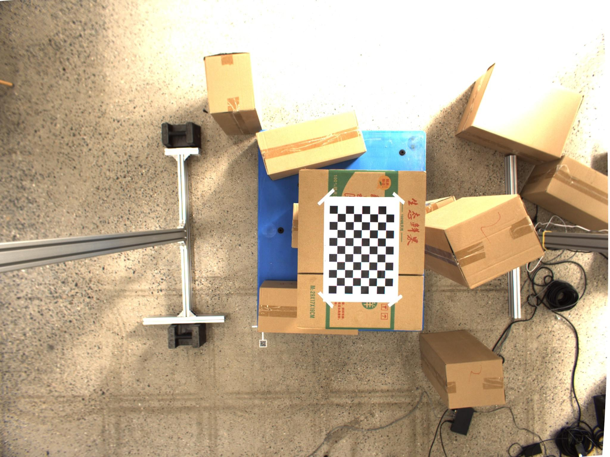
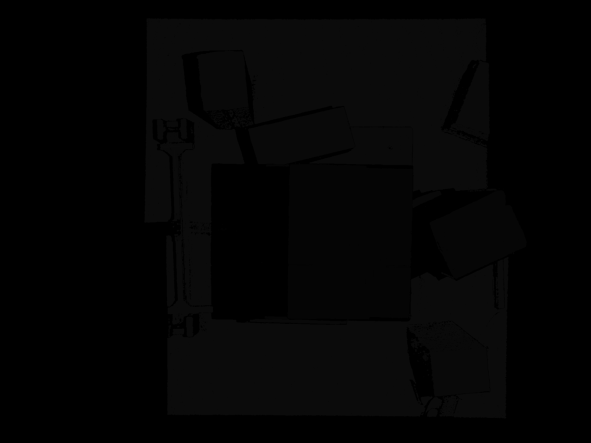
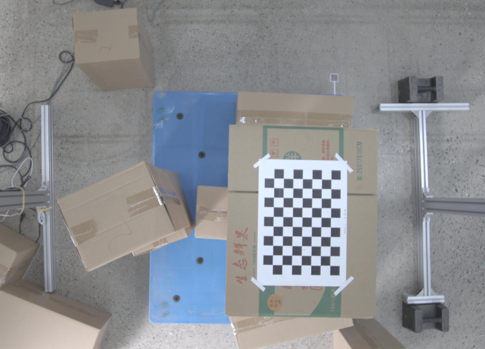
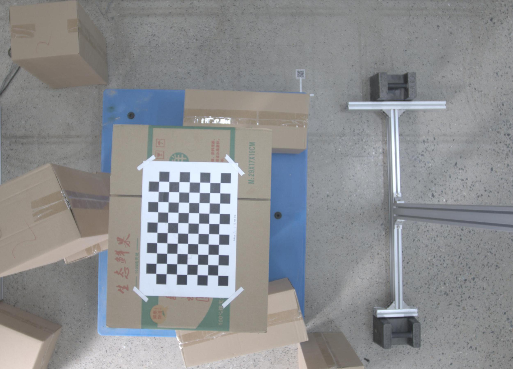
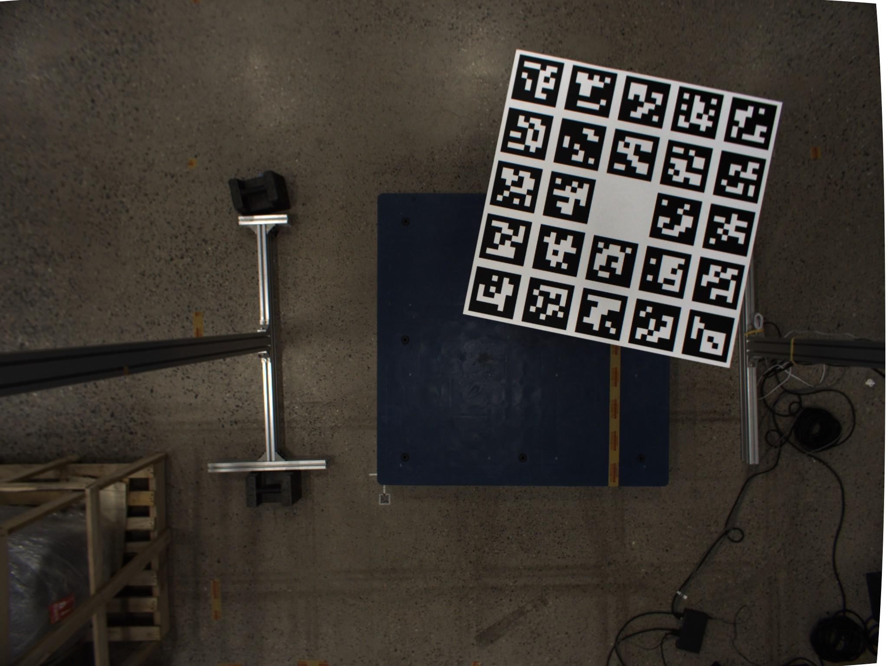
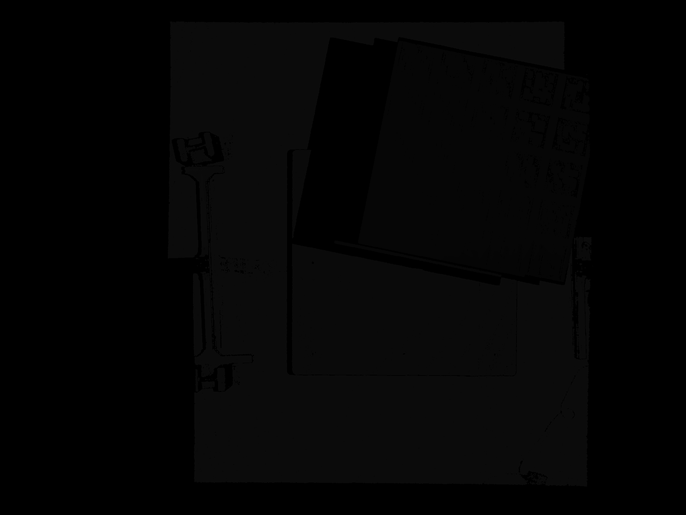
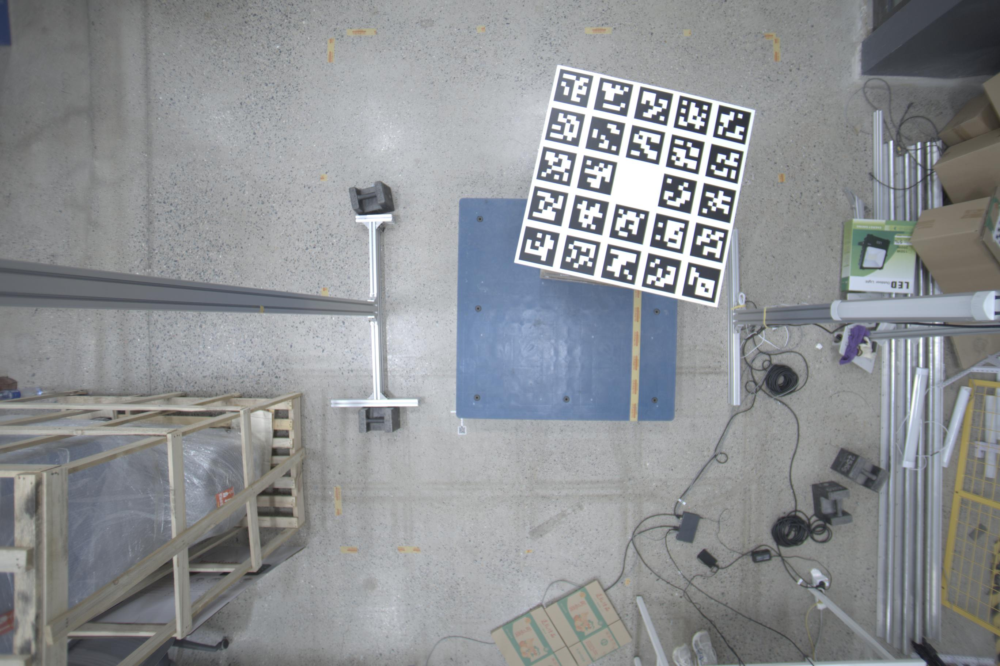
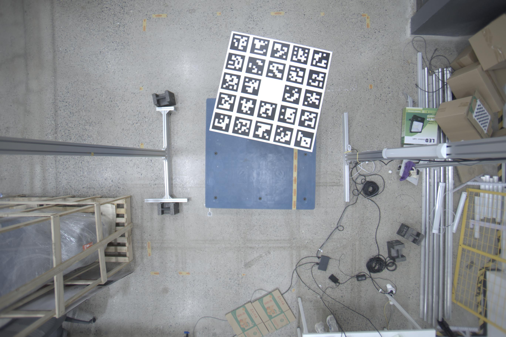

# Example calibration board images for `calibrating`


Example images are captured by paired_stereo_and_depth_cams:  
[](https://github.com/yl-data/calibrating_example_data/raw/master/paired_stereo_and_depth_cams.jpg?raw=true)

## File structure
```bash
$ tree .
├── depth_camera_intric.yaml
├── paired_stereo_and_depth_cams_checkboard
│   ├── 1
|   |   ├── depth_cam_color.jpg
|   |   ├── depth_cam_depth.png
|   |   ├── stereo_l.jpg
|   |   └── stereo_r.jpg
|   ├── ...
│   └── 9
├── paired_stereo_and_depth_cams_aruco
│   ├── 1
│   ├── ...
│   └── 9
└── README.md
```
## Checkboard example
**depth_cam_color.jpg**:  

**depth_cam_depth.png**:  

**stereo_l.jpg**:  

**stereo_r.jpg**:  



## Marker example: `cv2.aruco`
**depth_cam_color.jpg**:  

**depth_cam_depth.png**:  

**stereo_l.jpg**:  

**stereo_r.jpg**:  



Note: 
- aruco images are resized by `boxx.resize(img, 0.5)`
- Checkboard images are croped by `python -m boxx.script "p-[imsave(pa, imread(pa)[924:2724,1486:3986]) for pa in glob('*/stereo*.jpg')]"`

